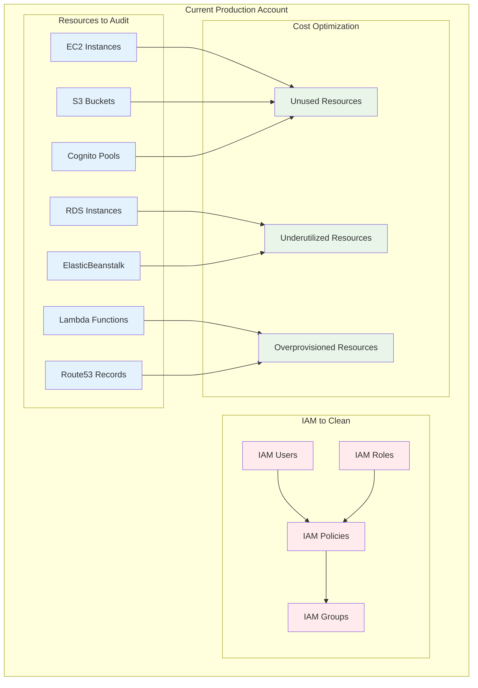
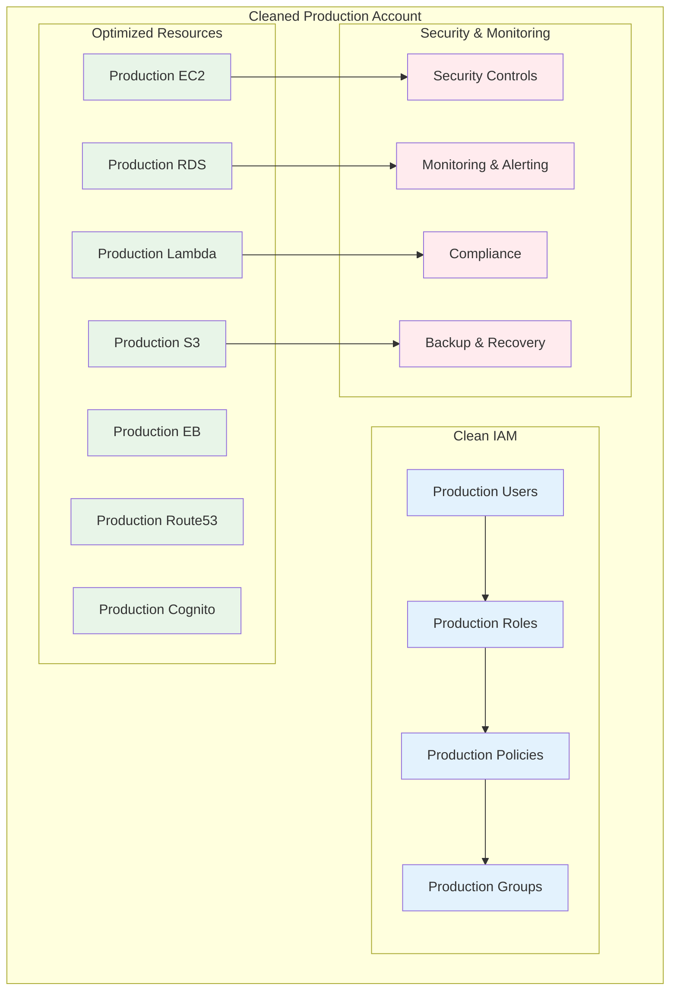
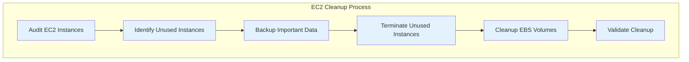
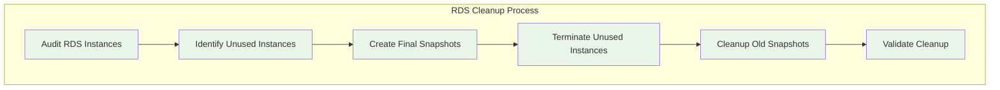
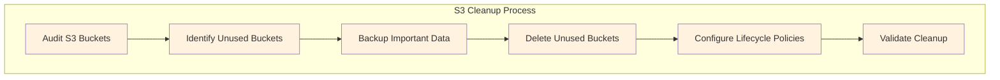
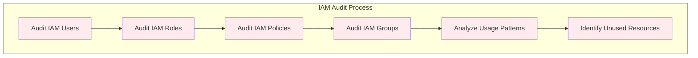
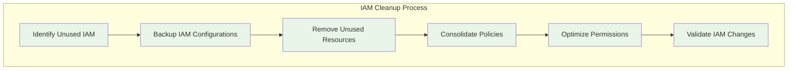
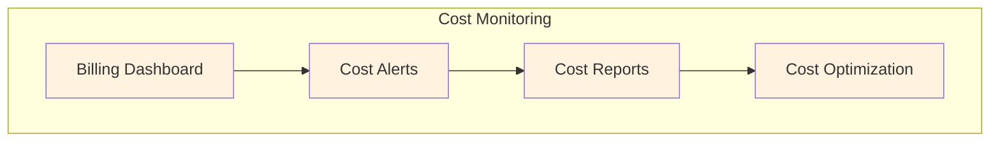
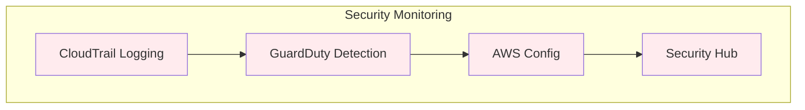

# Production Account Cleanup Plan

## Overview

This plan focuses on cleaning up the existing AWS account that will become production-only after the Dev account is established. The goal is to remove unused resources, clean up IAM, and optimize the production environment for security and cost efficiency.

## 🎯 Cleanup Goals

- **Remove Unused Resources**: Clean up unused EC2, RDS, Lambda, and other resources
- **IAM Cleanup**: Remove unused roles, policies, and users
- **Cost Optimization**: Reduce unnecessary costs
- **Security Hardening**: Improve security posture
- **Production Focus**: Optimize for production workloads only

## 📋 Cleanup Scope

### Phase 1: Resource Audit & Analysis (Weeks 1-2)
- Comprehensive audit of all AWS resources
- Identify unused and underutilized resources
- Document resource dependencies
- Create cleanup prioritization

### Phase 2: IAM Cleanup (Weeks 3-4)
- Audit all IAM users, roles, and policies
- Remove unused and overprivileged access
- Implement least privilege principles
- Clean up inline policies and unused policies

### Phase 3: Resource Cleanup (Weeks 5-6)
- Remove unused EC2 instances and volumes
- Clean up unused RDS instances and snapshots
- Remove unused Lambda functions
- Clean up unused S3 buckets and objects

### Phase 4: Security Hardening (Weeks 7-8)
- Implement security best practices
- Configure monitoring and alerting
- Set up compliance monitoring
- Document production procedures

## 🏗️ Cleanup Architecture

### Current State Analysis

### Target State

## 📚 Implementation Timeline

### Phase 1: Resource Audit & Analysis (Weeks 1-2)

| Week | Task | Description | Deliverable | Hours | Dependencies |
|------|------|-------------|-------------|-------|--------------|
| 1 | 1.1 | Audit all EC2 instances and volumes | EC2 audit report | 4 | None |
| 1 | 1.2 | Audit all RDS instances and snapshots | RDS audit report | 3 | EC2 audit |
| 1 | 1.3 | Audit all Lambda functions | Lambda audit report | 2 | RDS audit |
| 1 | 1.4 | Audit all S3 buckets and objects | S3 audit report | 3 | Lambda audit |
| 1 | 1.5 | Audit ElasticBeanstalk applications | EB audit report | 2 | S3 audit |
| 2 | 1.6 | Audit Route53 records and hosted zones | Route53 audit report | 2 | EB audit |
| 2 | 1.7 | Audit Cognito user pools | Cognito audit report | 2 | Route53 audit |
| 2 | 1.8 | Identify unused and underutilized resources | Unused resources list | 4 | All audits |
| 2 | 1.9 | Create cleanup prioritization | Cleanup priority list | 3 | Unused resources |
| 2 | 1.10 | Document resource dependencies | Dependencies map | 3 | Cleanup priority |

### Phase 2: IAM Cleanup (Weeks 3-4)

| Week | Task | Description | Deliverable | Hours | Dependencies |
|------|------|-------------|-------------|-------|--------------|
| 3 | 2.1 | Audit all IAM users | IAM users audit | 3 | Resource audit |
| 3 | 2.2 | Audit all IAM roles | IAM roles audit | 4 | Users audit |
| 3 | 2.3 | Audit all IAM policies | IAM policies audit | 4 | Roles audit |
| 3 | 2.4 | Audit IAM groups | IAM groups audit | 2 | Policies audit |
| 3 | 2.5 | Identify unused IAM resources | Unused IAM list | 3 | Groups audit |
| 4 | 2.6 | Remove unused IAM users | Unused users removed | 2 | Unused IAM list |
| 4 | 2.7 | Remove unused IAM roles | Unused roles removed | 3 | Users removed |
| 4 | 2.8 | Remove unused IAM policies | Unused policies removed | 3 | Roles removed |
| 4 | 2.9 | Clean up inline policies | Inline policies cleaned | 2 | Policies removed |
| 4 | 2.10 | Implement least privilege access | Least privilege implemented | 4 | Inline policies cleaned |

### Phase 3: Resource Cleanup (Weeks 5-6)

| Week | Task | Description | Deliverable | Hours | Dependencies |
|------|------|-------------|-------------|-------|--------------|
| 5 | 3.1 | Remove unused EC2 instances | Unused EC2 removed | 3 | IAM cleanup |
| 5 | 3.2 | Remove unused EBS volumes | Unused volumes removed | 2 | EC2 cleanup |
| 5 | 3.3 | Remove unused RDS instances | Unused RDS removed | 3 | Volumes cleanup |
| 5 | 3.4 | Clean up RDS snapshots | Old snapshots removed | 2 | RDS cleanup |
| 5 | 3.5 | Remove unused Lambda functions | Unused Lambda removed | 2 | RDS snapshots |
| 6 | 3.6 | Clean up unused S3 buckets | Unused buckets removed | 3 | Lambda cleanup |
| 6 | 3.7 | Clean up S3 objects | Old objects removed | 2 | S3 buckets |
| 6 | 3.8 | Remove unused ElasticBeanstalk | Unused EB removed | 2 | S3 objects |
| 6 | 3.9 | Clean up unused Route53 records | Unused records removed | 2 | EB cleanup |
| 6 | 3.10 | Optimize Cognito configuration | Cognito optimized | 3 | Route53 cleanup |

### Phase 4: Security Hardening (Weeks 7-8)

| Week | Task | Description | Deliverable | Hours | Dependencies |
|------|------|-------------|-------------|-------|--------------|
| 7 | 4.1 | Implement security best practices | Security best practices | 4 | Resource cleanup |
| 7 | 4.2 | Configure monitoring and alerting | Monitoring configured | 3 | Security practices |
| 7 | 4.3 | Set up compliance monitoring | Compliance monitoring | 3 | Monitoring setup |
| 7 | 4.4 | Configure backup and recovery | Backup configured | 2 | Compliance setup |
| 7 | 4.5 | Implement access logging | Access logging enabled | 2 | Backup setup |
| 8 | 4.6 | Test security configurations | Security testing | 3 | Access logging |
| 8 | 4.7 | Document production procedures | Production runbooks | 4 | Security testing |
| 8 | 4.8 | Train team on production procedures | Team training | 3 | Documentation |
| 8 | 4.9 | Conduct final validation | Final validation | 3 | Team training |
| 8 | 4.10 | Complete production handoff | Production handoff | 2 | Final validation |

## 🔍 Detailed Cleanup Procedures

### EC2 Instance Cleanup

### RDS Cleanup Process

### S3 Cleanup Process

## 🔒 IAM Cleanup Strategy

### IAM Audit Process

### IAM Cleanup Process

## 📊 Cost Optimization

### Cost Optimization Goals
- **Identify and remove unused resources** to reduce costs
- **Optimize resource utilization** for better efficiency
- **Implement cost monitoring** to track savings
- **Document cost optimization** procedures

### Cost Monitoring

## 🚨 Security Hardening

### Security Improvements
- **Access Control**: Implement least privilege access
- **Monitoring**: Enhanced security monitoring
- **Compliance**: Automated compliance checking
- **Backup**: Comprehensive backup and recovery

### Security Monitoring

## 📈 Success Metrics

### Technical Metrics
- **Resource Cleanup**: Remove all identified unused resources
- **Cost Optimization**: Achieve measurable cost savings
- **Security Score**: Improved security posture
- **Compliance**: Meet all compliance requirements

### Business Metrics
- **Cost Optimization**: Achieve cost savings through cleanup
- **Security**: Enhanced security posture
- **Efficiency**: Improved operational efficiency
- **Compliance**: Better compliance management

## 🎯 Deliverables

### Phase 1 Deliverables
- Comprehensive resource audit reports
- Unused resources identification
- Cleanup prioritization plan
- Dependencies mapping

### Phase 2 Deliverables
- IAM audit reports
- Unused IAM resources removed
- Least privilege access implemented
- IAM best practices documentation

### Phase 3 Deliverables
- Unused resources removed
- Cost optimization achieved
- Resource cleanup validation
- Cleanup procedures documentation

### Phase 4 Deliverables
- Security hardening completed
- Monitoring and alerting configured
- Production procedures documented
- Team training completed

## 🚀 Next Steps

1. **Stakeholder Approval**: Get approval for cleanup plan
2. **Resource Allocation**: Allocate necessary resources
3. **Timeline Confirmation**: Confirm 8-week timeline
4. **Team Preparation**: Prepare cleanup team
5. **Communication**: Begin stakeholder communication

---

**Last Updated**: September 25, 2025
**Version**: 1.0
**Status**: Planning Phase
