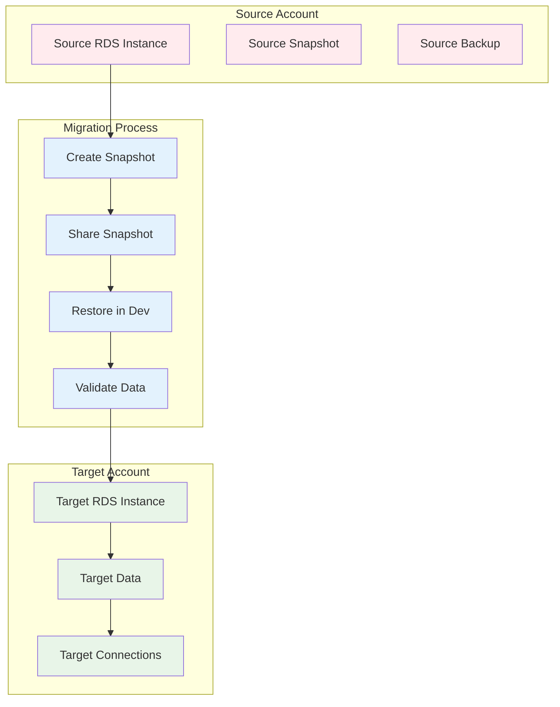
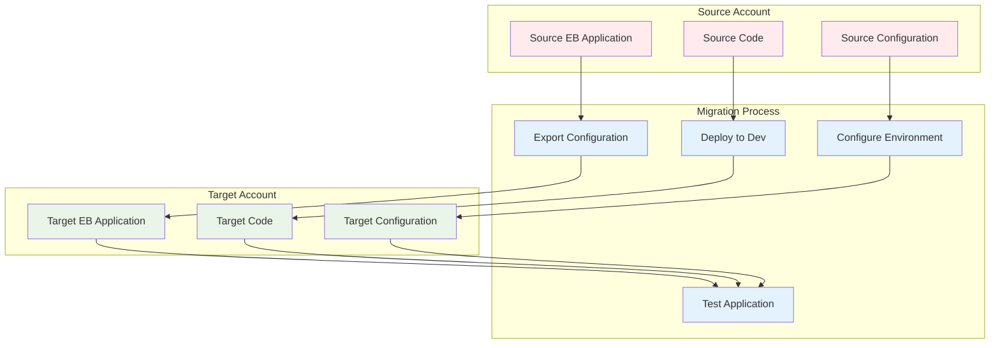
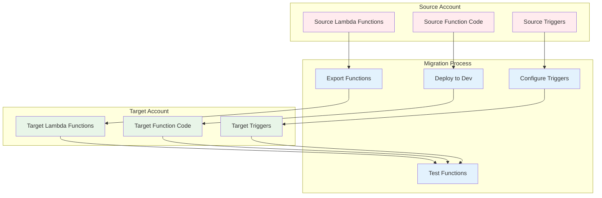
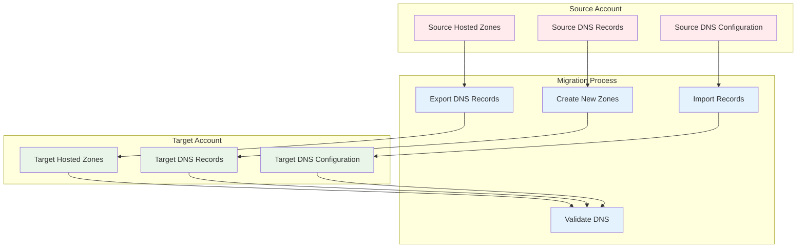
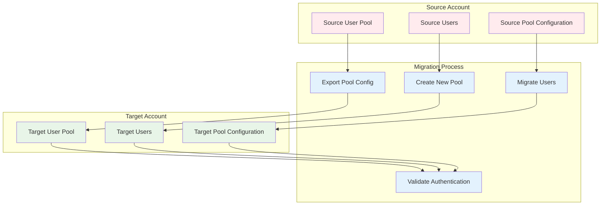

# High-Level Data Migration Plan

## Overview

This document outlines the high-level data migration plan for moving resources from the existing AWS account to the new Dev account, including RDS, ElasticBeanstalk, Lambda functions, Route53, and Cognito.

## 🎯 Migration Goals

- **Zero Data Loss**: Ensure all data is preserved during migration
- **Minimal Downtime**: Minimize service disruption during migration
- **Data Integrity**: Maintain data consistency and integrity
- **Rollback Capability**: Ability to quickly revert if issues arise
- **Testing**: Comprehensive testing of all migrated resources

## 📋 Resource Migration Overview

### 1. RDS Data Migration

#### **Current State Analysis**
- Document all RDS instances and configurations
- Identify database sizes and storage requirements
- Map database dependencies and connections
- Document backup and recovery procedures

#### **Migration Strategy**

#### **Migration Steps**
1. **Pre-Migration**
   - Create final snapshots of all RDS instances
   - Document current database configurations
   - Identify all application connections
   - Plan maintenance windows

2. **Migration Execution**
   - Create snapshots of production databases
   - Share snapshots with new Dev account
   - Restore databases in new Dev account
   - Configure security groups and access

3. **Post-Migration**
   - Validate data integrity and consistency
   - Test database connections and performance
   - Update application configurations
   - Document new database locations

#### **Timeline**: 2-3 days per database
#### **Risk Level**: Medium
#### **Rollback**: Restore from snapshots

### 2. ElasticBeanstalk Application Migration

#### **Current State Analysis**
- Document all EB applications and environments
- Identify application code repositories
- Map environment configurations and variables
- Document deployment procedures

#### **Migration Strategy**

#### **Migration Steps**
1. **Pre-Migration**
   - Export EB application configurations
   - Document environment variables and settings
   - Identify code repositories and versions
   - Plan deployment procedures

2. **Migration Execution**
   - Create new EB applications in Dev account
   - Deploy application code to new environments
   - Configure environment variables and settings
   - Set up monitoring and logging

3. **Post-Migration**
   - Test application functionality
   - Validate all integrations and dependencies
   - Update DNS and load balancer configurations
   - Document new application locations

#### **Timeline**: 1-2 days per application
#### **Risk Level**: Low
#### **Rollback**: Revert to original EB environments

### 3. Lambda Function Migration

#### **Current State Analysis**
- Document all Lambda functions and configurations
- Identify function dependencies and layers
- Map event sources and triggers
- Document function code and versions

#### **Migration Strategy**

#### **Migration Steps**
1. **Pre-Migration**
   - Export Lambda function configurations
   - Document function code and dependencies
   - Identify all triggers and event sources
   - Plan function deployment procedures

2. **Migration Execution**
   - Create new Lambda functions in Dev account
   - Deploy function code to new functions
   - Configure triggers and event sources
   - Set up monitoring and logging

3. **Post-Migration**
   - Test function execution and performance
   - Validate all triggers and integrations
   - Update application configurations
   - Document new function locations

#### **Timeline**: 1 day per function
#### **Risk Level**: Low
#### **Rollback**: Revert to original Lambda functions

### 4. Route53 DNS Migration

#### **Current State Analysis**
- Document all hosted zones and DNS records
- Identify domain ownership and configurations
- Map DNS dependencies and integrations
- Document DNS management procedures

#### **Migration Strategy**

#### **Migration Steps**
1. **Pre-Migration**
   - Export all hosted zones and DNS records
   - Document domain ownership and configurations
   - Identify DNS dependencies and integrations
   - Plan DNS cutover procedures

2. **Migration Execution**
   - Create new hosted zones in Dev account
   - Import all DNS records to new zones
   - Configure domain ownership and settings
   - Set up DNS monitoring and logging

3. **Post-Migration**
   - Test DNS resolution and functionality
   - Validate all DNS records and configurations
   - Update application DNS configurations
   - Document new DNS locations

#### **Timeline**: 1 day per hosted zone
#### **Risk Level**: Medium
#### **Rollback**: Revert DNS records to original zones

### 5. Cognito User Migration

#### **Current State Analysis**
- Document all Cognito user pools and configurations
- Identify user data and custom attributes
- Map authentication flows and integrations
- Document user management procedures

#### **Migration Strategy**

#### **Migration Steps**
1. **Pre-Migration**
   - Export Cognito user pool configurations
   - Document user data and custom attributes
   - Identify authentication flows and integrations
   - Plan user migration procedures

2. **Migration Execution**
   - Create new user pools in Dev account
   - Configure identical settings and attributes
   - Migrate user data (if applicable)
   - Set up authentication flows and integrations

3. **Post-Migration**
   - Test authentication and user management
   - Validate all user flows and integrations
   - Update application configurations
   - Document new user pool locations

#### **Timeline**: 2-3 days per user pool
#### **Risk Level**: High
#### **Rollback**: Revert to original user pools

## 📊 Migration Timeline

### **Week 1-2: Preparation**
- Complete resource analysis and documentation
- Set up migration tools and procedures
- Create backup and rollback plans
- **No user impact**

### **Week 3-4: Infrastructure Migration**
- Migrate RDS databases
- Migrate ElasticBeanstalk applications
- Migrate Lambda functions
- **Minimal user impact**

### **Week 5-6: DNS and Cognito Migration**
- Migrate Route53 DNS records
- Migrate Cognito user pools
- Test all integrations
- **Potential user impact**

### **Week 7-8: Validation and Cleanup**
- Comprehensive testing and validation
- Performance optimization
- Documentation and training
- **No user impact**

## 🔒 Security Considerations

### **Data Security**
- **Encryption**: Maintain encryption standards during migration
- **Access Control**: Secure access to migration tools and data
- **Audit Logging**: Comprehensive logging of all migration activities
- **Data Integrity**: Validate data integrity at each step

### **Network Security**
- **VPN Access**: Secure access to migration environments
- **Network Isolation**: Proper network segmentation
- **Firewall Rules**: Appropriate firewall configurations
- **Monitoring**: Continuous security monitoring

### **Compliance**
- **Data Privacy**: Maintain data privacy standards
- **Regulatory Compliance**: Ensure compliance with regulations
- **Audit Trails**: Complete audit trails for all activities
- **Documentation**: Comprehensive security documentation

## 🚨 Risk Mitigation

### **Technical Risks**
- **Data Loss**: Comprehensive backup and testing procedures
- **Service Disruption**: Staged migration approach
- **Integration Issues**: Thorough testing of all integrations
- **Performance Impact**: Load testing and monitoring

### **Business Risks**
- **User Impact**: Minimal user impact through staged approach
- **Timeline Delays**: Buffer time in schedule
- **Resource Constraints**: Adequate resource allocation
- **Knowledge Gaps**: Comprehensive training and documentation

### **Rollback Procedures**
- **Quick Rollback**: Ability to revert within hours
- **Data Recovery**: Restore from backups if needed
- **Service Restoration**: Restore original configurations
- **Communication**: Notify stakeholders of rollback

## 📈 Success Metrics

### **Technical Metrics**
- **Data Integrity**: 100% data preservation
- **Service Availability**: 99.9% uptime during migration
- **Performance**: Maintained or improved performance
- **Security**: No security incidents

### **Business Metrics**
- **User Satisfaction**: No user complaints
- **Service Quality**: Maintained service levels
- **Cost Optimization**: Improved cost structure
- **Operational Efficiency**: Enhanced operations

## 📄 Deliverables

### **Pre-Migration Deliverables**
- Resource analysis and documentation
- Migration tools and procedures
- Backup and rollback plans
- Security configurations

### **Migration Deliverables**
- Migrated RDS databases
- Migrated ElasticBeanstalk applications
- Migrated Lambda functions
- Migrated Route53 DNS records
- Migrated Cognito user pools

### **Post-Migration Deliverables**
- Comprehensive testing results
- Performance optimization
- Updated documentation
- Team training completion

## 🎯 Next Steps

1. **Stakeholder Approval**: Get approval for migration plan
2. **Resource Allocation**: Allocate necessary resources
3. **Timeline Confirmation**: Confirm migration timeline
4. **Team Preparation**: Prepare migration team
5. **Communication**: Begin stakeholder communication

---

**Last Updated**: September 25, 2025
**Version**: 1.0
**Status**: Planning Phase
