# AWS Infrastructure Modernization - Architecture Documentation

## Overview

This document outlines the planned AWS infrastructure modernization project, including the current state, target architecture, and migration path. The project aims to modernize the existing AWS infrastructure by implementing containerization, improved security, and enhanced observability.

## Table of Contents

1. [Current State](#current-state)
2. [Target Architecture](#target-architecture)
3. [Security Zones](#security-zones)
4. [Migration Path](#migration-path)
5. [Component Details](#component-details)
6. [Implementation Plan](#implementation-plan)

## Current State

The current infrastructure consists of:
- Elastic Beanstalk applications
- API Gateway for traffic routing
- EC2 instances for various services
- Legacy IAM structure
- Single VPC with mixed environments
- Limited security monitoring
- No containerization

## Target Architecture

### Main Infrastructure Diagram

```mermaid
graph TB
    %% External Components
    Internet[🌐 Internet]
    WAF[AWS WAF]
    VPN[🔒 AWS VPN Gateway - Employee Access]
    
    %% AWS Regions
    subgraph "AWS Region (Primary)"
        subgraph "Dev VPC (10.0.0.0/16)"
            subgraph "Dev Public Subnet (10.0.1.0/24)"
                DevIGW[Internet Gateway]
                DevNAT[NAT Gateway]
                DevALB[Application Load Balancer]
            end
            
            subgraph "Dev Private Subnet (10.0.2.0/24)"
                DevEKS[EKS Cluster - Dev]
                DevSigNoz[SigNoz Monitoring]
                DevVault[Hashicorp Vault - TBT Manager]
            end
            
            subgraph "Dev Database Subnet (10.0.3.0/24)"
                DevRDS[RDS Database]
            end
            
            subgraph "Dev Shared Services (10.0.4.0/24)"
                DevWazuh[Wazuh Security Hub]
                DevArgoCD[ArgoCD]
            end
        end
        
        subgraph "Prod VPC (10.1.0.0/16)"
            subgraph "Prod Public Subnet (10.1.1.0/24)"
                ProdIGW[Internet Gateway]
                ProdNAT[NAT Gateway]
                ProdALB[Application Load Balancer]
            end
            
            subgraph "Prod Private Subnet (10.1.2.0/24)"
                ProdEKS[EKS Cluster - Prod]
                ProdSigNoz[SigNoz Monitoring]
                ProdVault[Hashicorp Vault - TBT Manager]
            end
            
            subgraph "Prod Database Subnet (10.1.3.0/24)"
                ProdRDS[RDS Database]
            end
            
            subgraph "Prod Shared Services (10.1.4.0/24)"
                ProdWazuh[Wazuh Security Hub]
                ProdArgoCD[ArgoCD]
            end
        end
        
        %% AWS Services
        subgraph "AWS Global Services"
            IAM[IAM Roles & Policies]
            S3[S3 Buckets]
            ECR[ECR Container Registry]
            CloudTrail[CloudTrail]
            GuardDuty[GuardDuty]
            Config[AWS Config]
            SecurityHub[Security Hub]
            Inspector[Inspector]
            Macie[Macie]
        end
        
        %% Lambda Functions
        subgraph "Lambda Functions"
            Lambda1[Lambda Function #1]
        end
        
        %% Employee Access
        subgraph "Employee Access"
            EmployeeVPN[Employee VPN Client]
            BastionHost[Bastion Host - Optional]
        end
    end
    
    %% EKS Cluster Details
    subgraph "EKS Cluster Components"
        subgraph "Dev EKS Cluster"
            DevIstio[Istio Service Mesh]
            DevApps[Containerized Applications]
            DevOTEL[OpenTelemetry Collectors]
        end
        
        subgraph "Prod EKS Cluster"
            ProdIstio[Istio Service Mesh]
            ProdApps[Containerized Applications]
            ProdOTEL[OpenTelemetry Collectors]
        end
    end
    
    %% External Traffic Flow (Public Access)
    Internet --> WAF
    WAF --> DevALB
    WAF --> ProdALB
    
    %% Internal Employee Access Flow
    EmployeeVPN --> VPN
    VPN --> DevIGW
    VPN --> ProdIGW
    
    %% Network Connections
    DevIGW --> DevALB
    ProdIGW --> ProdALB
    
    DevALB --> DevEKS
    ProdALB --> ProdEKS
    
    DevEKS --> DevIstio
    ProdEKS --> ProdIstio
    
    DevIstio --> DevApps
    ProdIstio --> ProdApps
    
    DevApps --> DevOTEL
    ProdApps --> ProdOTEL
    
    DevOTEL --> DevSigNoz
    ProdOTEL --> ProdSigNoz
    
    %% Database Connections
    DevApps --> DevRDS
    ProdApps --> ProdRDS
    
    %% Security Connections
    DevWazuh --> CloudTrail
    DevWazuh --> GuardDuty
    DevWazuh --> Config
    ProdWazuh --> CloudTrail
    ProdWazuh --> GuardDuty
    ProdWazuh --> Config
    
    %% Vault TBT Connections
    DevVault -.->|Time-Based Tokens| DevRDS
    ProdVault -.->|Time-Based Tokens| ProdRDS
    DevApps --> DevVault
    ProdApps --> ProdVault
    
    %% AWS Service Connections
    DevEKS --> IAM
    ProdEKS --> IAM
    DevApps --> S3
    ProdApps --> S3
    DevApps --> ECR
    ProdApps --> ECR
    
    %% Monitoring Connections
    DevSigNoz --> SecurityHub
    ProdSigNoz --> SecurityHub
    DevSigNoz --> Inspector
    ProdSigNoz --> Inspector
    DevSigNoz --> Macie
    ProdSigNoz --> Macie
    
    %% ArgoCD Connections
    DevArgoCD --> DevEKS
    ProdArgoCD --> ProdEKS
    
    %% Lambda Integration
    Lambda1 --> S3
    Lambda1 --> IAM
    
    %% Employee Access to Resources
    EmployeeVPN --> BastionHost
    BastionHost --> DevEKS
    BastionHost --> ProdEKS
    
    %% Styling
    classDef vpc fill:#e1f5fe
    classDef eks fill:#f3e5f5
    classDef security fill:#ffebee
    classDef monitoring fill:#e8f5e8
    classDef aws fill:#fff3e0
    classDef external fill:#fce4ec
    classDef employee fill:#e0f2f1
    
    class DevVPC,ProdVPC vpc
    class DevEKS,ProdEKS,DevIstio,ProdIstio,DevApps,ProdApps eks
    class DevWazuh,ProdWazuh,DevVault,ProdVault,VPN,WAF security
    class DevSigNoz,ProdSigNoz,DevOTEL,ProdOTEL monitoring
    class IAM,S3,ECR,CloudTrail,GuardDuty,Config,SecurityHub,Inspector,Macie aws
    class Internet external
    class EmployeeVPN,BastionHost employee
```

### Key Architecture Components

#### Network Architecture
- **Dev VPC**: 10.0.0.0/16 with isolated subnets
- **Prod VPC**: 10.1.0.0/16 with isolated subnets
- **VPN Gateway**: Internal employee access only
- **AWS WAF**: Protection for external load balancers
- **NAT Gateways**: Internet access for private subnets

#### Traffic Flow
- **External Users**: Internet → WAF → Load Balancer → EKS
- **Internal Employees**: VPN → VPC → Direct access to resources
- **Bastion Host**: Optional secure access for administrative tasks

#### EKS Clusters
- **Dev EKS**: Development environment with Istio service mesh
- **Prod EKS**: Production environment with Istio service mesh
- **Node Groups**: Auto-scaling worker nodes
- **IRSA**: IAM roles for service accounts

## Security Zones

## Vault Time-Based Token Management

## WAF Configuration

## VPN Access Control

## Migration Path

## Component Details

### Security & Compliance
- **Wazuh**: Security information and event management
- **Hashicorp Vault**: Time-Based Token (TBT) management for RDS
- **AWS Security Hub**: Centralized security findings
- **GuardDuty**: Threat detection
- **AWS Config**: Compliance monitoring
- **AWS WAF**: Web application firewall for external traffic

### Observability
- **SigNoz**: Application monitoring and alerting
- **OpenTelemetry**: Distributed tracing and metrics
- **CloudTrail**: API activity logging
- **VPC Flow Logs**: Network traffic monitoring

### Application Deployment
- **ArgoCD**: GitOps continuous deployment
- **Istio**: Service mesh for traffic management
- **ECR**: Container image registry
- **Helm Charts**: Application packaging

### Data Storage
- **RDS**: Managed databases with encryption
- **S3**: Object storage with lifecycle policies
- **DynamoDB**: State locking for Pulumi

## Implementation Plan

### Phase 1: Foundation & Pulumi Setup (Weeks 1-2)
- Install Pulumi CLI and configure AWS access
- Set up S3 backend for state management
- Create project structure and stacks
- Configure version control

### Phase 2: VPC Architecture (Weeks 3-4)
- Design and create Dev VPC with subnets
- Design and create Prod VPC with subnets
- Configure NAT Gateways and route tables

### Phase 3: IAM Overhaul (Weeks 5-6)
- Audit existing IAM structure
- Create role-based access policies
- Enable IAM Access Analyzer
- Remove root access keys

### Phase 4: Application Containerization (Weeks 7-10)
- Inventory existing applications
- Create Dockerfiles for each application
- Set up ECR repositories
- Create Helm charts

### Phase 5: EKS Cluster Setup (Weeks 11-12)
- Deploy Dev EKS cluster
- Deploy Prod EKS cluster
- Install Istio service mesh
- Configure ingress gateways

### Phase 6: Application Deployment (Weeks 13-14)
- Deploy applications to Dev EKS
- Deploy applications to Prod EKS
- Configure Istio routing
- Test application connectivity

### Phase 7: Observability - SigNoz (Weeks 15-16)
- Deploy SigNoz to EKS clusters
- Configure OpenTelemetry collectors
- Create dashboards and alerts
- Instrument applications

### Phase 8: Security - Wazuh (Weeks 17-18)
- Deploy Wazuh manager
- Configure AWS integrations
- Set up security dashboards
- Configure alerting rules

### Phase 9: Security Hardening (Weeks 19-20)
- Enable AWS Security Hub
- Configure VPC Flow Logs
- Harden security groups and NACLs
- Enable encryption

### Phase 10: VPN & Network Security (Weeks 21-22)
- Deploy VPN Gateway
- Configure VPN connections
- Set up employee access controls
- Test secure access

### Phase 11: Hashicorp Vault Integration (Weeks 23-24)
- Deploy Vault to EKS
- Configure TBT engine
- Integrate with applications
- Set up audit logging

### Phase 12: Cleanup & Finalization (Weeks 25-26)
- Remove legacy resources
- Create CI/CD pipelines
- Document architecture
- Conduct knowledge transfer

## Cost Optimization

- **Reserved Instances**: For predictable workloads
- **Spot Instances**: For development and testing
- **Auto Scaling**: Based on demand
- **S3 Lifecycle**: Automated data tiering
- **RDS Multi-AZ**: For production databases only
- **WAF**: Pay-per-request model

## Disaster Recovery

- **Cross-Region Backups**: S3 and RDS
- **Multi-AZ Deployment**: Production workloads
- **Automated Failover**: RDS and ALB
- **WAF**: Global protection across regions
- **Documentation**: Runbooks and procedures

## Risk Mitigation

- Each phase includes testing and validation steps
- Rollback procedures documented for each major change
- Staged deployment (Dev → Prod) reduces risk
- Comprehensive documentation ensures knowledge retention 