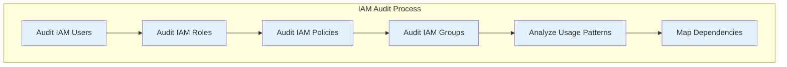
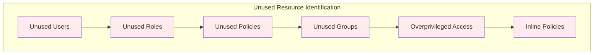
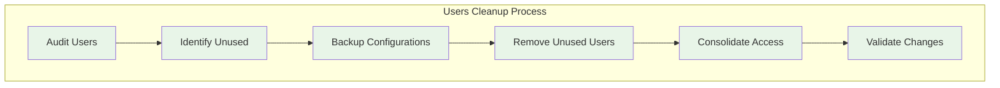
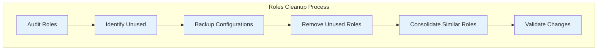
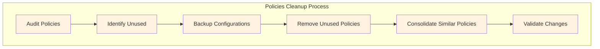
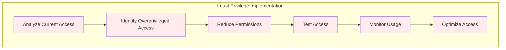
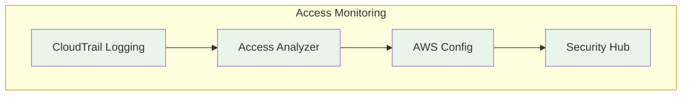

# IAM Cleanup Strategy for Production Account

## Overview

This document provides a detailed strategy for cleaning up IAM in the production account, focusing on removing unused resources, implementing least privilege access, and improving security posture.

## 🎯 IAM Cleanup Goals

- **Remove Unused Resources**: Eliminate unused users, roles, policies, and groups
- **Implement Least Privilege**: Ensure all access follows least privilege principles
- **Consolidate Policies**: Replace inline policies with managed policies
- **Improve Security**: Enhance overall security posture
- **Document Best Practices**: Create comprehensive IAM documentation

## 📋 IAM Cleanup Scope

### Users Cleanup
- Remove unused and inactive users
- Consolidate user access patterns
- Implement MFA requirements
- Clean up user permissions

### Roles Cleanup
- Remove unused service roles
- Consolidate similar roles
- Implement least privilege access
- Clean up role permissions

### Policies Cleanup
- Remove unused managed policies
- Replace inline policies with managed policies
- Consolidate similar policies
- Implement least privilege policies

### Groups Cleanup
- Remove unused groups
- Consolidate group memberships
- Implement group-based access control
- Clean up group permissions

## 🔍 IAM Audit Process

### Step 1: Comprehensive Audit

### Step 2: Identify Unused Resources

## 🧹 IAM Cleanup Procedures

### Users Cleanup

### Roles Cleanup

### Policies Cleanup

## 🔒 Security Hardening

### Least Privilege Implementation

### Access Monitoring

## 📊 IAM Cleanup Goals

### Cleanup Objectives
- **Remove all unused users** identified in audit
- **Remove all unused roles** identified in audit
- **Remove all unused policies** identified in audit
- **Replace all inline policies** with managed policies
- **Implement least privilege access** for all resources

### Success Criteria
- **Unused Resources**: 0% unused resources remaining
- **Inline Policies**: 0% inline policies remaining
- **Overprivileged Access**: 0% overprivileged access remaining
- **MFA Coverage**: 100% MFA coverage for all users

## 🎯 Cleanup Priorities

### High Priority
1. **Remove Unused Users**: Immediate security risk
2. **Remove Unused Roles**: Reduce attack surface
3. **Remove Inline Policies**: Improve maintainability
4. **Implement MFA**: Enhance security

### Medium Priority
1. **Consolidate Similar Roles**: Improve management
2. **Consolidate Similar Policies**: Reduce complexity
3. **Implement Least Privilege**: Improve security
4. **Document Access Patterns**: Improve visibility

### Low Priority
1. **Optimize Group Memberships**: Improve efficiency
2. **Implement Access Reviews**: Improve governance
3. **Create Access Documentation**: Improve knowledge
4. **Implement Automation**: Improve efficiency

## 🚨 Risk Mitigation

### Backup Procedures
- **Export IAM Configurations**: Before any changes
- **Document Current State**: Complete documentation
- **Test Changes**: In non-production environment
- **Rollback Plan**: Quick rollback procedures

### Validation Procedures
- **Access Testing**: Test all access after changes
- **Functionality Testing**: Test all applications
- **Security Testing**: Validate security improvements
- **Performance Testing**: Ensure no performance impact

## 📈 Success Metrics

### Security Metrics
- **Unused Resources**: All unused resources removed
- **Overprivileged Access**: All overprivileged access eliminated
- **Inline Policies**: All inline policies replaced
- **MFA Coverage**: All users have MFA enabled

### Operational Metrics
- **Access Management**: Improved efficiency
- **Security Posture**: Enhanced security
- **Compliance**: Better compliance
- **Documentation**: Complete documentation

## 🎯 Deliverables

### Phase 1: Audit (Week 3)
- Comprehensive IAM audit reports
- Unused resources identification
- Dependencies mapping
- Cleanup prioritization

### Phase 2: Cleanup (Week 4)
- Unused resources removed
- Inline policies replaced
- Least privilege implemented
- Access consolidated

### Phase 3: Hardening (Week 7)
- Security best practices implemented
- Monitoring configured
- Access logging enabled
- Documentation completed

### Phase 4: Validation (Week 8)
- All changes validated
- Security testing completed
- Team training completed
- Production handoff completed

## 🚀 Implementation Timeline

### Week 3: IAM Audit
- **Day 1-2**: Audit users and roles
- **Day 3-4**: Audit policies and groups
- **Day 5**: Analyze usage patterns and dependencies

### Week 4: IAM Cleanup
- **Day 1-2**: Remove unused users and roles
- **Day 3-4**: Remove unused policies and groups
- **Day 5**: Implement least privilege access

### Week 7: Security Hardening
- **Day 1-2**: Implement security best practices
- **Day 3-4**: Configure monitoring and alerting
- **Day 5**: Implement access logging

### Week 8: Validation
- **Day 1-2**: Test all changes
- **Day 3-4**: Document procedures
- **Day 5**: Complete handoff

## 📄 Documentation

### IAM Best Practices Guide
- **User Management**: Best practices for user management
- **Role Management**: Best practices for role management
- **Policy Management**: Best practices for policy management
- **Access Control**: Best practices for access control

### Production Procedures
- **User Onboarding**: Procedures for new users
- **Access Requests**: Procedures for access requests
- **Access Reviews**: Procedures for access reviews
- **Emergency Access**: Procedures for emergency access

---

**Last Updated**: September 25, 2025
**Version**: 1.0
**Status**: Planning Phase
