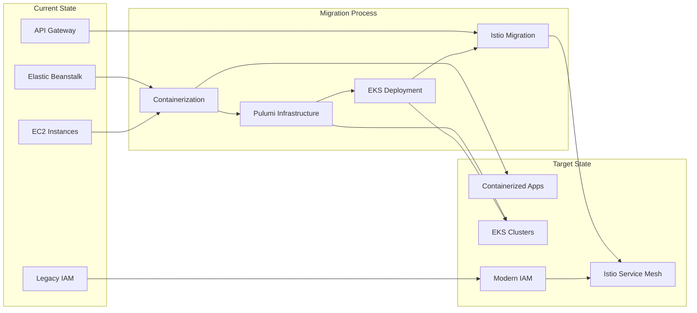
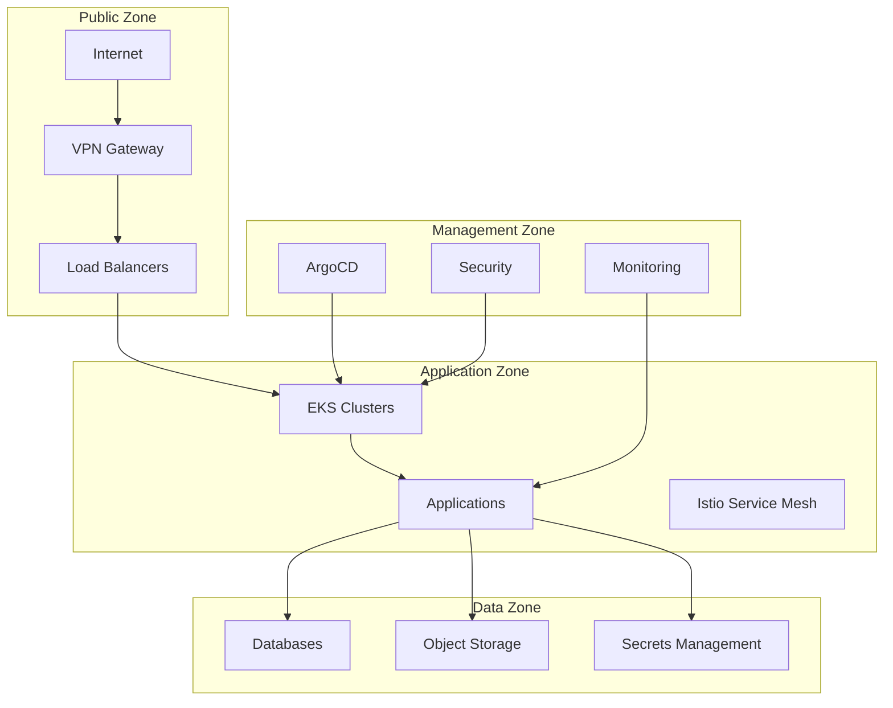

# AWS Infrastructure Modernization - Architecture Diagram

## Current vs. Planned Infrastructure

```mermaid
graph TB
    %% External Components
    Internet[🌐 Internet]
    VPN[🔒 AWS VPN Gateway]
    
    %% AWS Regions
    subgraph "AWS Region (Primary)"
        subgraph "Dev VPC (10.0.0.0/16)"
            subgraph "Dev Public Subnet (10.0.1.0/24)"
                DevIGW[Internet Gateway]
                DevNAT[NAT Gateway]
                DevALB[Application Load Balancer]
            end
            
            subgraph "Dev Private Subnet (10.0.2.0/24)"
                DevEKS[EKS Cluster - Dev]
                DevSigNoz[SigNoz Monitoring]
                DevVault[Hashicorp Vault]
            end
            
            subgraph "Dev Database Subnet (10.0.3.0/24)"
                DevRDS[RDS Database]
            end
            
            subgraph "Dev Shared Services (10.0.4.0/24)"
                DevWazuh[Wazuh Security Hub]
                DevArgoCD[ArgoCD]
            end
        end
        
        subgraph "Prod VPC (10.1.0.0/16)"
            subgraph "Prod Public Subnet (10.1.1.0/24)"
                ProdIGW[Internet Gateway]
                ProdNAT[NAT Gateway]
                ProdALB[Application Load Balancer]
            end
            
            subgraph "Prod Private Subnet (10.1.2.0/24)"
                ProdEKS[EKS Cluster - Prod]
                ProdSigNoz[SigNoz Monitoring]
                ProdVault[Hashicorp Vault]
            end
            
            subgraph "Prod Database Subnet (10.1.3.0/24)"
                ProdRDS[RDS Database]
            end
            
            subgraph "Prod Shared Services (10.1.4.0/24)"
                ProdWazuh[Wazuh Security Hub]
                ProdArgoCD[ArgoCD]
            end
        end
        
        %% AWS Services
        subgraph "AWS Global Services"
            IAM[IAM Roles & Policies]
            S3[S3 Buckets]
            ECR[ECR Container Registry]
            CloudTrail[CloudTrail]
            GuardDuty[GuardDuty]
            Config[AWS Config]
            SecurityHub[Security Hub]
            Inspector[Inspector]
            Macie[Macie]
        end
        
        %% Lambda Functions
        subgraph "Lambda Functions"
            Lambda1[Lambda Function #1]
        end
    end
    
    %% EKS Cluster Details
    subgraph "EKS Cluster Components"
        subgraph "Dev EKS Cluster"
            DevIstio[Istio Service Mesh]
            DevApps[Containerized Applications]
            DevOTEL[OpenTelemetry Collectors]
        end
        
        subgraph "Prod EKS Cluster"
            ProdIstio[Istio Service Mesh]
            ProdApps[Containerized Applications]
            ProdOTEL[OpenTelemetry Collectors]
        end
    end
    
    %% Network Connections
    Internet --> VPN
    VPN --> DevIGW
    VPN --> ProdIGW
    
    DevIGW --> DevALB
    ProdIGW --> ProdALB
    
    DevALB --> DevEKS
    ProdALB --> ProdEKS
    
    DevEKS --> DevIstio
    ProdEKS --> ProdIstio
    
    DevIstio --> DevApps
    ProdIstio --> ProdApps
    
    DevApps --> DevOTEL
    ProdApps --> ProdOTEL
    
    DevOTEL --> DevSigNoz
    ProdOTEL --> ProdSigNoz
    
    %% Database Connections
    DevApps --> DevRDS
    ProdApps --> ProdRDS
    
    %% Security Connections
    DevWazuh --> CloudTrail
    DevWazuh --> GuardDuty
    DevWazuh --> Config
    ProdWazuh --> CloudTrail
    ProdWazuh --> GuardDuty
    ProdWazuh --> Config
    
    %% Vault Connections
    DevVault --> DevRDS
    ProdVault --> ProdRDS
    DevApps --> DevVault
    ProdApps --> ProdVault
    
    %% AWS Service Connections
    DevEKS --> IAM
    ProdEKS --> IAM
    DevApps --> S3
    ProdApps --> S3
    DevApps --> ECR
    ProdApps --> ECR
    
    %% Monitoring Connections
    DevSigNoz --> SecurityHub
    ProdSigNoz --> SecurityHub
    DevSigNoz --> Inspector
    ProdSigNoz --> Inspector
    DevSigNoz --> Macie
    ProdSigNoz --> Macie
    
    %% ArgoCD Connections
    DevArgoCD --> DevEKS
    ProdArgoCD --> ProdEKS
    
    %% Lambda Integration
    Lambda1 --> S3
    Lambda1 --> IAM
    
    %% Styling
    classDef vpc fill:#e1f5fe
    classDef eks fill:#f3e5f5
    classDef security fill:#ffebee
    classDef monitoring fill:#e8f5e8
    classDef aws fill:#fff3e0
    classDef external fill:#fce4ec
    
    class DevVPC,ProdVPC vpc
    class DevEKS,ProdEKS,DevIstio,ProdIstio,DevApps,ProdApps eks
    class DevWazuh,ProdWazuh,DevVault,ProdVault,VPN security
    class DevSigNoz,ProdSigNoz,DevOTEL,ProdOTEL monitoring
    class IAM,S3,ECR,CloudTrail,GuardDuty,Config,SecurityHub,Inspector,Macie aws
    class Internet external
```

## Key Architecture Components

### Network Architecture
- **Dev VPC**: 10.0.0.0/16 with isolated subnets
- **Prod VPC**: 10.1.0.0/16 with isolated subnets
- **VPN Gateway**: Secure access to both VPCs
- **NAT Gateways**: Internet access for private subnets

### EKS Clusters
- **Dev EKS**: Development environment with Istio service mesh
- **Prod EKS**: Production environment with Istio service mesh
- **Node Groups**: Auto-scaling worker nodes
- **IRSA**: IAM roles for service accounts

### Security & Compliance
- **Wazuh**: Security information and event management
- **Hashicorp Vault**: Secrets management and database credentials
- **AWS Security Hub**: Centralized security findings
- **GuardDuty**: Threat detection
- **AWS Config**: Compliance monitoring

### Observability
- **SigNoz**: Application monitoring and alerting
- **OpenTelemetry**: Distributed tracing and metrics
- **CloudTrail**: API activity logging
- **VPC Flow Logs**: Network traffic monitoring

### Application Deployment
- **ArgoCD**: GitOps continuous deployment
- **Istio**: Service mesh for traffic management
- **ECR**: Container image registry
- **Helm Charts**: Application packaging

### Data Storage
- **RDS**: Managed databases with encryption
- **S3**: Object storage with lifecycle policies
- **DynamoDB**: State locking for Pulumi

## Migration Path

## Security Zones

## Cost Optimization

- **Reserved Instances**: For predictable workloads
- **Spot Instances**: For development and testing
- **Auto Scaling**: Based on demand
- **S3 Lifecycle**: Automated data tiering
- **RDS Multi-AZ**: For production databases only

## Disaster Recovery

- **Cross-Region Backups**: S3 and RDS
- **Multi-AZ Deployment**: Production workloads
- **Automated Failover**: RDS and ALB
- **Documentation**: Runbooks and procedures 