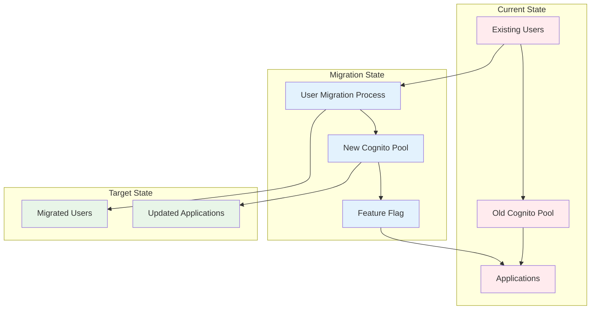
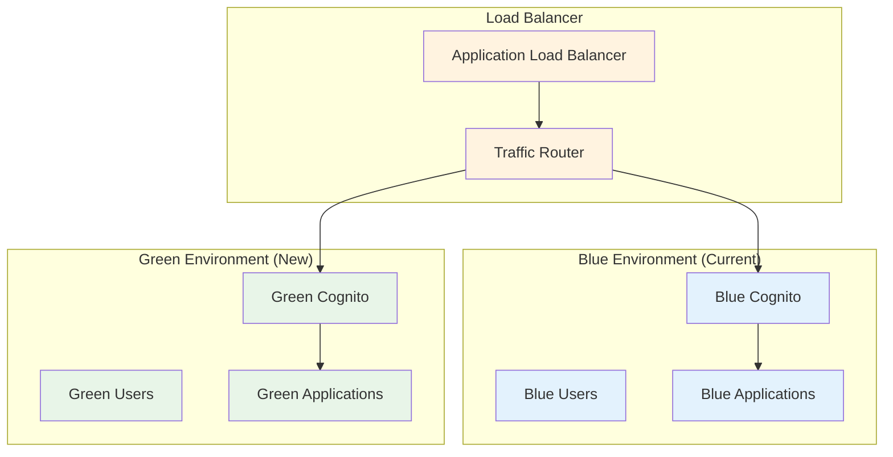

# AWS Cognito Migration Plan - Production to New Account

## Overview

This plan outlines the migration of production Cognito from the current AWS account to a new dedicated production AWS account, while maintaining minimal customer impact and ensuring zero downtime.

## 🎯 Migration Goals

- **Zero Downtime**: Maintain continuous service during migration
- **Minimal Customer Impact**: Seamless transition for end users
- **Data Integrity**: Ensure all user data and configurations are preserved
- **Security**: Maintain or improve security posture
- **Rollback Capability**: Ability to quickly revert if issues arise

## 📋 Current State Analysis

### Current Setup
- **Single AWS Account**: Contains both Prod and Dev Cognito instances
- **Prod Cognito**: Active production user pool
- **Dev Cognito**: Development/testing user pool
- **Shared Resources**: Other AWS services in the same account

### Target State
- **New Production Account**: Dedicated account for production Cognito
- **Existing Account**: Retain Dev Cognito and other services
- **Account Separation**: Clear separation of production and development environments

## 🏗️ Migration Strategy

### Phase 1: Pre-Migration Preparation (Week 1)

#### 1.1 Account Setup
- Create new AWS production account
- Configure IAM roles and policies
- Set up billing and cost management
- Configure CloudTrail and security services

#### 1.2 Cognito Analysis
- Document current Cognito configuration
- Identify all dependencies and integrations
- Map user data and attributes
- Document authentication flows

#### 1.3 Backup and Documentation
- Export current Cognito configuration
- Backup user data (if applicable)
- Document all integrations and dependencies
- Create rollback procedures

### Phase 2: Parallel Environment Setup (Week 2)

#### 2.1 New Cognito Setup
- Create new Cognito user pool in production account
- Configure identical settings and attributes
- Set up app clients and identity providers
- Configure custom domain (if applicable)

#### 2.2 Integration Preparation
- Update application configurations for new Cognito
- Prepare DNS changes for custom domains
- Set up monitoring and alerting
- Configure backup and disaster recovery

### Phase 3: Gradual Migration (Week 3)

#### 3.1 Blue-Green Deployment
- Deploy new Cognito alongside existing
- Use feature flags to control traffic
- Implement gradual user migration
- Monitor performance and errors

#### 3.2 User Migration Strategy
- **Option A**: Gradual user migration (recommended)
- **Option B**: Full cutover with maintenance window
- **Option C**: Hybrid approach with fallback

### Phase 4: Cutover and Cleanup (Week 4)

#### 4.1 Final Cutover
- Route all traffic to new Cognito
- Verify all functionality
- Monitor for issues
- Update DNS and configurations

#### 4.2 Cleanup
- Remove old Cognito resources
- Update documentation
- Conduct post-migration testing
- Train team on new setup

## 🔄 Migration Approaches

### Approach 1: Gradual User Migration (Recommended)

### Approach 2: Blue-Green Deployment

## 📊 Detailed Migration Plan

### Week 1: Preparation

| Day | Task | Description | Hours | Dependencies |
|-----|------|-------------|-------|--------------|
| 1 | 1.1 | Create new AWS production account | 2 | None |
| 1 | 1.2 | Configure IAM roles and policies | 3 | New account |
| 1 | 1.3 | Set up billing and cost management | 1 | New account |
| 2 | 1.4 | Configure CloudTrail and security services | 2 | IAM setup |
| 2 | 1.5 | Document current Cognito configuration | 4 | None |
| 3 | 1.6 | Identify all dependencies and integrations | 4 | Cognito analysis |
| 3 | 1.7 | Map user data and attributes | 3 | Dependencies analysis |
| 4 | 1.8 | Document authentication flows | 3 | User data mapping |
| 4 | 1.9 | Export current Cognito configuration | 2 | Authentication flows |
| 5 | 1.10 | Create rollback procedures | 4 | All documentation |

### Week 2: Parallel Setup

| Day | Task | Description | Hours | Dependencies |
|-----|------|-------------|-------|--------------|
| 1 | 2.1 | Create new Cognito user pool | 3 | New account setup |
| 1 | 2.2 | Configure identical settings and attributes | 4 | New user pool |
| 2 | 2.3 | Set up app clients and identity providers | 3 | User pool configuration |
| 2 | 2.4 | Configure custom domain (if applicable) | 2 | App clients |
| 3 | 2.5 | Update application configurations | 4 | New Cognito setup |
| 3 | 2.6 | Prepare DNS changes for custom domains | 2 | Custom domain setup |
| 4 | 2.7 | Set up monitoring and alerting | 3 | Application updates |
| 4 | 2.8 | Configure backup and disaster recovery | 2 | Monitoring setup |
| 5 | 2.9 | Test new Cognito setup | 4 | All configurations |
| 5 | 2.10 | Validate all integrations | 3 | Testing complete |

### Week 3: Gradual Migration

| Day | Task | Description | Hours | Dependencies |
|-----|------|-------------|-------|--------------|
| 1 | 3.1 | Deploy feature flags for traffic control | 3 | New setup complete |
| 1 | 3.2 | Start with 10% traffic to new Cognito | 2 | Feature flags |
| 2 | 3.3 | Monitor performance and errors | 4 | Traffic routing |
| 2 | 3.4 | Increase to 25% traffic | 2 | Monitoring stable |
| 3 | 3.5 | Monitor and validate 25% traffic | 4 | Traffic increase |
| 3 | 3.6 | Increase to 50% traffic | 2 | Validation complete |
| 4 | 3.7 | Monitor and validate 50% traffic | 4 | Traffic increase |
| 4 | 3.8 | Increase to 75% traffic | 2 | Validation complete |
| 5 | 3.9 | Monitor and validate 75% traffic | 4 | Traffic increase |
| 5 | 3.10 | Prepare for 100% cutover | 3 | Validation complete |

### Week 4: Cutover and Cleanup

| Day | Task | Description | Hours | Dependencies |
|-----|------|-------------|-------|--------------|
| 1 | 4.1 | Route 100% traffic to new Cognito | 2 | 75% validation |
| 1 | 4.2 | Monitor for issues | 4 | 100% cutover |
| 2 | 4.3 | Verify all functionality | 4 | Issue monitoring |
| 2 | 4.4 | Update DNS and configurations | 2 | Functionality verified |
| 3 | 4.5 | Remove old Cognito resources | 3 | DNS updated |
| 3 | 4.6 | Update documentation | 2 | Old resources removed |
| 4 | 4.7 | Conduct post-migration testing | 4 | Documentation updated |
| 4 | 4.8 | Train team on new setup | 3 | Testing complete |
| 5 | 4.9 | Final validation and handoff | 4 | Team training |
| 5 | 4.10 | Project completion | 2 | Final validation |

## 🔒 Security Considerations

### Pre-Migration Security
- **Access Control**: Ensure proper IAM roles for migration
- **Data Encryption**: Maintain encryption standards
- **Audit Logging**: Enable comprehensive logging
- **Backup Security**: Secure backup procedures

### During Migration Security
- **Traffic Monitoring**: Monitor for security issues
- **Access Validation**: Verify user access continues
- **Data Integrity**: Ensure data remains secure
- **Incident Response**: Ready response procedures

### Post-Migration Security
- **Access Review**: Review all access patterns
- **Security Validation**: Validate security controls
- **Monitoring**: Enhanced monitoring setup
- **Documentation**: Update security procedures

## 🚨 Risk Mitigation

### Technical Risks
- **Data Loss**: Comprehensive backup and testing
- **Service Disruption**: Gradual migration approach
- **Integration Issues**: Thorough testing of all integrations
- **Performance Impact**: Load testing and monitoring

### Business Risks
- **Customer Impact**: Minimal through gradual migration
- **Downtime**: Zero downtime approach
- **Data Privacy**: Maintain privacy standards
- **Compliance**: Ensure regulatory compliance

### Rollback Procedures
- **Quick Rollback**: Ability to revert within minutes
- **Data Recovery**: Restore from backups if needed
- **Service Restoration**: Restore original configuration
- **Communication**: Notify stakeholders of rollback

## 📈 Success Metrics

### Technical Metrics
- **Zero Downtime**: 100% uptime during migration
- **Data Integrity**: 100% data preservation
- **Performance**: Maintain or improve performance
- **Security**: No security incidents

### Business Metrics
- **Customer Satisfaction**: No customer complaints
- **Service Quality**: Maintained service levels
- **Cost Optimization**: Improved cost structure
- **Operational Efficiency**: Enhanced operations

## 🔄 Rollback Plan

### Immediate Rollback (0-15 minutes)
1. **Traffic Routing**: Route traffic back to old Cognito
2. **DNS Changes**: Revert DNS configurations
3. **Feature Flags**: Disable new Cognito traffic
4. **Monitoring**: Activate rollback monitoring

### Extended Rollback (15-60 minutes)
1. **Data Sync**: Sync any new data back to old system
2. **Configuration**: Restore old configurations
3. **Integrations**: Revert integration changes
4. **Validation**: Validate rollback success

### Full Rollback (1-4 hours)
1. **Complete Revert**: Full system reversion
2. **Data Recovery**: Restore from backups
3. **Service Restoration**: Complete service restoration
4. **Communication**: Notify all stakeholders

## 📞 Communication Plan

### Pre-Migration
- **Stakeholder Notification**: Inform all stakeholders
- **Customer Communication**: Notify customers if needed
- **Team Briefing**: Brief all team members
- **Vendor Coordination**: Coordinate with vendors

### During Migration
- **Status Updates**: Regular status updates
- **Issue Communication**: Immediate issue notification
- **Progress Reports**: Daily progress reports
- **Escalation**: Clear escalation procedures

### Post-Migration
- **Success Notification**: Notify of successful migration
- **Issue Resolution**: Address any remaining issues
- **Documentation**: Update all documentation
- **Lessons Learned**: Document lessons learned

## 📄 Deliverables

### Week 1 Deliverables
- New AWS production account
- IAM roles and policies
- Cognito configuration documentation
- Rollback procedures

### Week 2 Deliverables
- New Cognito user pool
- Updated application configurations
- Monitoring and alerting setup
- Backup and disaster recovery

### Week 3 Deliverables
- Feature flag implementation
- Gradual traffic migration
- Performance monitoring
- Issue resolution

### Week 4 Deliverables
- Complete cutover
- Old resource cleanup
- Updated documentation
- Team training completion

## 📊 Cost Analysis

### Migration Costs
- **New Account Setup**: ~$500
- **Migration Tools**: ~$1,000
- **Additional Monitoring**: ~$300/month
- **Team Time**: ~$15,000

### Ongoing Cost Benefits
- **Account Separation**: Better cost tracking
- **Resource Optimization**: Improved resource utilization
- **Security**: Enhanced security posture
- **Compliance**: Better compliance management

## 🎯 Next Steps

1. **Stakeholder Approval**: Get approval for migration plan
2. **Resource Allocation**: Allocate necessary resources
3. **Timeline Confirmation**: Confirm migration timeline
4. **Team Preparation**: Prepare migration team
5. **Communication**: Begin stakeholder communication

---

**Last Updated**: [Current Date]
**Version**: 1.0
**Status**: Planning Phase
