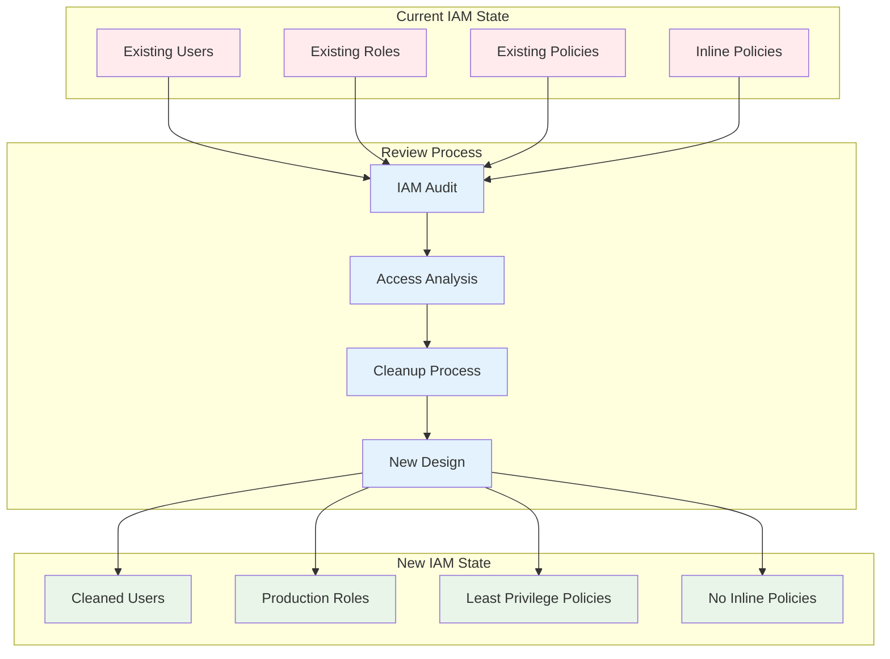
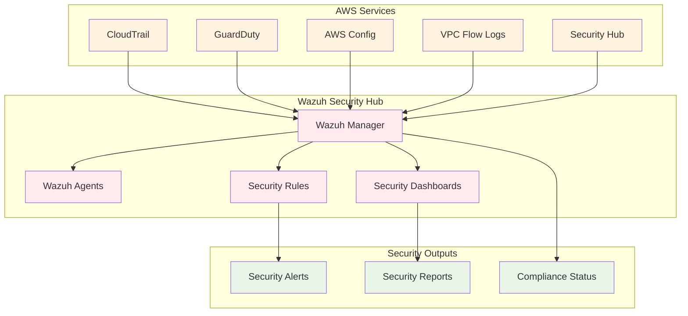
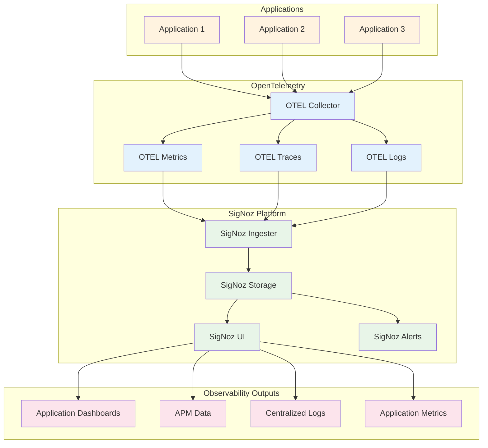

# AWS Infrastructure Subset - Architecture Diagram

## IAM Review & New Production Environment

```mermaid
graph TB
    %% External Components
    Internet[🌐 Internet]
    WAF[AWS WAF]
    
    %% AWS Regions
    subgraph "AWS Region (Primary)"
        subgraph "Existing Environment"
            ExistingVPC[Existing VPC]
            ExistingApps[Existing Applications]
            ExistingIAM[Existing IAM - Under Review]
        end
        
        subgraph "New Production VPC (10.1.0.0/16)"
            subgraph "Prod Public Subnet (10.1.1.0/24)"
                ProdIGW[Internet Gateway]
                ProdNAT[NAT Gateway]
                ProdALB[Application Load Balancer]
            end
            
            subgraph "Prod Private Subnet (10.1.2.0/24)"
                ProdApps[Production Applications]
                ProdOTEL[OpenTelemetry Collectors]
            end
            
            subgraph "Prod Database Subnet (10.1.3.0/24)"
                ProdRDS[RDS Database]
            end
            
            subgraph "Prod Security Subnet (10.1.4.0/24)"
                ProdWazuh[Wazuh Security Hub]
                ProdSigNoz[SigNoz Monitoring]
            end
        end
        
        %% AWS Services
        subgraph "AWS Global Services"
            IAM[IAM Roles & Policies - Reviewed]
            S3[S3 Buckets]
            CloudTrail[CloudTrail]
            GuardDuty[GuardDuty]
            Config[AWS Config]
            SecurityHub[Security Hub]
            VPCFlowLogs[VPC Flow Logs]
        end
    end
    
    %% External Traffic Flow
    Internet --> WAF
    WAF --> ProdALB
    
    %% Network Connections
    ProdIGW --> ProdALB
    ProdALB --> ProdApps
    
    %% Monitoring Connections
    ProdApps --> ProdOTEL
    ProdOTEL --> ProdSigNoz
    
    %% Database Connections
    ProdApps --> ProdRDS
    
    %% Security Connections
    ProdWazuh --> CloudTrail
    ProdWazuh --> GuardDuty
    ProdWazuh --> Config
    ProdWazuh --> VPCFlowLogs
    
    %% AWS Service Connections
    ProdApps --> IAM
    ProdApps --> S3
    ProdWazuh --> SecurityHub
    
    %% IAM Review Process
    ExistingIAM -.->|Review & Cleanup| IAM
    
    %% Styling
    classDef existing fill:#ffebee
    classDef vpc fill:#e1f5fe
    classDef security fill:#ffebee
    classDef monitoring fill:#e8f5e8
    classDef aws fill:#fff3e0
    classDef external fill:#fce4ec
    
    class ExistingVPC,ExistingApps,ExistingIAM existing
    class ProdVPC vpc
    class ProdWazuh security
    class ProdSigNoz,ProdOTEL monitoring
    class IAM,S3,CloudTrail,GuardDuty,Config,SecurityHub,VPCFlowLogs aws
    class Internet,WAF external
```

## Key Architecture Components

### Network Architecture
- **New Prod VPC**: 10.1.0.0/16 with isolated subnets
- **Public Subnet**: 10.1.1.0/24 (Load Balancers, NAT Gateways)
- **Private Subnet**: 10.1.2.0/24 (Applications, Monitoring)
- **Database Subnet**: 10.1.3.0/24 (RDS, Databases)
- **Security Subnet**: 10.1.4.0/24 (Wazuh, Security Tools)

### Traffic Flow
- **External Users**: Internet → WAF → Load Balancer → Applications
- **Internal Monitoring**: Applications → OpenTelemetry → SigNoz
- **Security Data**: AWS Services → Wazuh → Security Dashboards

### Security & Compliance
- **Wazuh**: Security information and event management
- **AWS Security Hub**: Centralized security findings
- **GuardDuty**: Threat detection
- **AWS Config**: Compliance monitoring
- **VPC Flow Logs**: Network traffic monitoring

### Observability
- **SigNoz**: Application monitoring and alerting
- **OpenTelemetry**: Distributed tracing and metrics
- **CloudTrail**: API activity logging

## IAM Review Process

## Security Monitoring with Wazuh

## Observability with SigNoz

## Implementation Phases

```mermaid
graph LR
    subgraph "Phase 1: IAM Review"
        A1[Audit Existing IAM]
        A2[Remove Unused Access]
        A3[Create New Roles]
        A4[Implement Least Privilege]
    end
    
    subgraph "Phase 2: New VPC"
        B1[Design VPC Architecture]
        B2[Create Production VPC]
        B3[Configure Security]
        B4[Enable Monitoring]
    end
    
    subgraph "Phase 3: Wazuh"
        C1[Deploy Wazuh]
        C2[Configure Integrations]
        C3[Create Dashboards]
        C4[Setup Alerting]
    end
    
    subgraph "Phase 4: SigNoz"
        D1[Deploy SigNoz]
        D2[Configure OTEL]
        D3[Setup APM]
        D4[Create Dashboards]
    end
    
    A1 --> A2
    A2 --> A3
    A3 --> A4
    A4 --> B1
    
    B1 --> B2
    B2 --> B3
    B3 --> B4
    B4 --> C1
    
    C1 --> C2
    C2 --> C3
    C3 --> C4
    C4 --> D1
    
    D1 --> D2
    D2 --> D3
    D3 --> D4
    
    %% Styling
    classDef phase1 fill:#ffebee
    classDef phase2 fill:#e1f5fe
    classDef phase3 fill:#ffebee
    classDef phase4 fill:#e8f5e8
    
    class A1,A2,A3,A4 phase1
    class B1,B2,B3,B4 phase2
    class C1,C2,C3,C4 phase3
    class D1,D2,D3,D4 phase4
```

## Security Best Practices

### Network Security
- **VPC Isolation**: Separate production environment
- **Subnet Segmentation**: Proper network boundaries
- **NACLs & Security Groups**: Defense in depth
- **VPC Flow Logs**: Complete network visibility

### Access Control
- **Least Privilege IAM**: Minimal required permissions
- **Role-based Access**: No long-term credentials
- **Regular Audits**: Ongoing access reviews
- **MFA Requirements**: Multi-factor authentication

### Monitoring & Compliance
- **Security Monitoring**: Wazuh SIEM
- **Compliance**: AWS Config and Security Hub
- **Audit Logging**: Comprehensive activity tracking
- **Threat Detection**: GuardDuty integration

## Cost Optimization

- **Single VPC**: Focus on production environment only
- **Right-sized resources**: Appropriate sizing for monitoring tools
- **Reserved instances**: For predictable workloads
- **S3 lifecycle**: Automated data tiering for logs

---

**Last Updated**: [Current Date]
**Version**: 1.0
**Status**: Planning Phase
