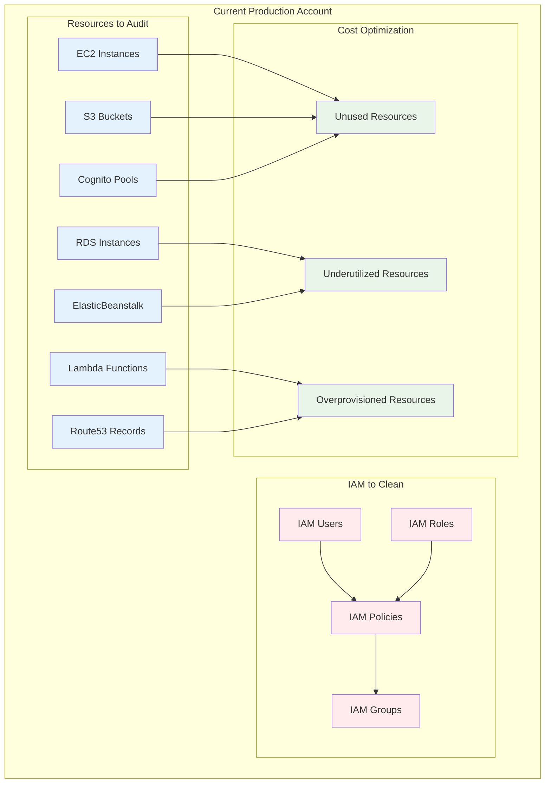
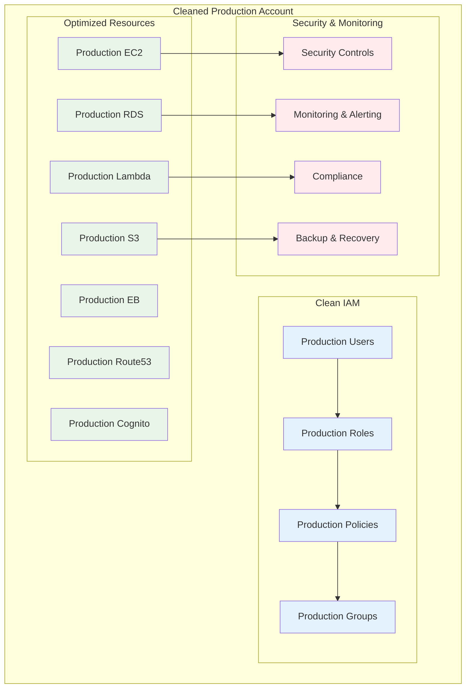

# Production Account Cleanup Plan

## Overview

This plan focuses on cleaning up the existing AWS account that will become production-only after the Dev account is established. **The cleanup will be based on findings and learnings from the Dev account setup and resource import process.** The goal is to remove unused resources, clean up IAM, and optimize the production environment for security and cost efficiency.

## 🎯 Cleanup Goals

- **Remove Unused Resources**: Clean up unused EC2, RDS, Lambda, and other resources
- **IAM Cleanup**: Remove unused roles, policies, and users
- **Cost Optimization**: Reduce unnecessary costs
- **Security Hardening**: Improve security posture
- **Production Focus**: Optimize for production workloads only

## 📋 Cleanup Scope

**Note: This cleanup will be executed AFTER the Dev account setup and resource import process is complete. The cleanup approach will be based on findings from the Dev account work.**

### Phase 1: Apply Dev Account Learnings (Weeks 1-2)
- Apply IAM cleanup strategies learned from Dev account
- Use resource import findings to identify unused resources
- Apply security best practices from Dev account setup
- Document production-specific requirements

### Phase 2: IAM Cleanup Based on Dev Learnings (Weeks 3-4)
- Apply IAM cleanup patterns from Dev account
- Remove unused and overprivileged access identified in Dev work
- Implement least privilege principles learned from Dev setup
- Clean up inline policies and unused policies

### Phase 3: Resource Cleanup Based on Dev Findings (Weeks 5-6)
- Remove resources identified as unused during Dev import process
- Clean up resources that were successfully migrated to Dev
- Remove development-specific resources that are no longer needed
- Optimize remaining production resources

### Phase 4: Production Security Hardening (Weeks 7-8)
- Implement production-specific security best practices
- Configure monitoring and alerting for production workloads
- Set up compliance monitoring for production environment
- Document production procedures and runbooks

## 🏗️ Cleanup Architecture

### Current State Analysis

### Target State

## 📚 Implementation Timeline

### Phase 1: Apply Dev Account Learnings (Weeks 1-2)

| Week | Task | Description | Deliverable | Hours | Dependencies |
|------|------|-------------|-------------|-------|--------------|
| 1 | 1.1 | Review Dev account IAM cleanup findings | Dev IAM findings review | 3 | Dev account complete |
| 1 | 1.2 | Apply IAM cleanup strategies to production | Production IAM cleanup plan | 4 | Dev findings review |
| 1 | 1.3 | Review Dev account resource import findings | Dev resource findings review | 3 | IAM cleanup plan |
| 1 | 1.4 | Identify production resources for cleanup | Production cleanup list | 4 | Dev resource findings |
| 1 | 1.5 | Apply security best practices from Dev | Production security plan | 3 | Production cleanup list |
| 2 | 1.6 | Document production-specific requirements | Production requirements doc | 2 | Security plan |
| 2 | 1.7 | Create production cleanup prioritization | Production cleanup priority | 3 | Requirements doc |
| 2 | 1.8 | Plan production resource optimization | Resource optimization plan | 3 | Cleanup priority |
| 2 | 1.9 | Document production dependencies | Production dependencies map | 2 | Optimization plan |
| 2 | 1.10 | Validate cleanup approach with stakeholders | Stakeholder validation | 2 | Dependencies map |

### Phase 2: IAM Cleanup Based on Dev Learnings (Weeks 3-4)

| Week | Task | Description | Deliverable | Hours | Dependencies |
|------|------|-------------|-------------|-------|--------------|
| 3 | 2.1 | Apply Dev IAM cleanup patterns to production | Production IAM cleanup | 3 | Dev learnings applied |
| 3 | 2.2 | Remove unused IAM users identified in Dev work | Unused users removed | 2 | IAM cleanup applied |
| 3 | 2.3 | Remove unused IAM roles identified in Dev work | Unused roles removed | 3 | Users removed |
| 3 | 2.4 | Remove unused IAM policies identified in Dev work | Unused policies removed | 3 | Roles removed |
| 3 | 2.5 | Clean up inline policies using Dev patterns | Inline policies cleaned | 2 | Policies removed |
| 4 | 2.6 | Implement least privilege access from Dev learnings | Least privilege implemented | 4 | Inline policies cleaned |
| 4 | 2.7 | Apply Dev security best practices to production | Production security applied | 3 | Least privilege implemented |
| 4 | 2.8 | Configure production-specific IAM monitoring | IAM monitoring configured | 2 | Security applied |
| 4 | 2.9 | Validate IAM cleanup with production workloads | IAM validation completed | 3 | Monitoring configured |
| 4 | 2.10 | Document production IAM procedures | Production IAM runbooks | 2 | Validation completed |

### Phase 3: Resource Cleanup Based on Dev Findings (Weeks 5-6)

| Week | Task | Description | Deliverable | Hours | Dependencies |
|------|------|-------------|-------------|-------|--------------|
| 5 | 3.1 | Remove resources identified as unused in Dev import | Unused resources removed | 3 | IAM cleanup |
| 5 | 3.2 | Clean up resources successfully migrated to Dev | Migrated resources cleaned | 2 | Unused resources removed |
| 5 | 3.3 | Remove development-specific resources no longer needed | Dev resources removed | 3 | Migrated resources cleaned |
| 5 | 3.4 | Optimize remaining production resources | Production resources optimized | 2 | Dev resources removed |
| 5 | 3.5 | Apply Dev cost optimization strategies to production | Production cost optimized | 2 | Resources optimized |
| 6 | 3.6 | Validate production resource functionality | Resource functionality validated | 3 | Cost optimized |
| 6 | 3.7 | Configure production-specific monitoring | Production monitoring configured | 2 | Functionality validated |
| 6 | 3.8 | Implement production backup strategies | Production backup implemented | 2 | Monitoring configured |
| 6 | 3.9 | Document production resource procedures | Production resource runbooks | 2 | Backup implemented |
| 6 | 3.10 | Train team on production resource management | Team training completed | 3 | Documentation completed |

### Phase 4: Production Security Hardening (Weeks 7-8)

| Week | Task | Description | Deliverable | Hours | Dependencies |
|------|------|-------------|-------------|-------|--------------|
| 7 | 4.1 | Implement production-specific security best practices | Production security implemented | 4 | Resource cleanup |
| 7 | 4.2 | Configure production monitoring and alerting | Production monitoring configured | 3 | Security implemented |
| 7 | 4.3 | Set up production compliance monitoring | Production compliance configured | 3 | Monitoring configured |
| 7 | 4.4 | Configure production backup and recovery | Production backup configured | 2 | Compliance configured |
| 7 | 4.5 | Implement production access logging | Production logging enabled | 2 | Backup configured |
| 8 | 4.6 | Test production security configurations | Production security testing | 3 | Logging enabled |
| 8 | 4.7 | Document production procedures and runbooks | Production runbooks completed | 4 | Security testing |
| 8 | 4.8 | Train team on production procedures | Production team training | 3 | Documentation completed |
| 8 | 4.9 | Conduct final production validation | Final production validation | 3 | Team training |
| 8 | 4.10 | Complete production environment handoff | Production handoff completed | 2 | Final validation |

## 🔍 Cleanup Approach

### Resource Cleanup Strategy
- **Identify unused resources** based on Dev account findings
- **Remove resources** that were successfully migrated to Dev
- **Clean up development-specific resources** no longer needed
- **Optimize remaining production resources** for efficiency

### IAM Cleanup Strategy
- **Apply Dev IAM patterns** to production environment
- **Remove unused users, roles, and policies** identified in Dev work
- **Implement least privilege access** using Dev learnings
- **Consolidate and optimize** IAM configurations

## 📊 Cost Optimization

### Cost Optimization Goals
- **Identify and remove unused resources** to reduce costs
- **Optimize resource utilization** for better efficiency
- **Implement cost monitoring** to track savings
- **Document cost optimization** procedures

## 🚨 Security Hardening

### Security Improvements
- **Access Control**: Implement least privilege access
- **Monitoring**: Enhanced security monitoring
- **Compliance**: Automated compliance checking
- **Backup**: Comprehensive backup and recovery

## 📈 Success Metrics

### Technical Metrics
- **Resource Cleanup**: Remove all identified unused resources
- **Cost Optimization**: Achieve measurable cost savings
- **Security Score**: Improved security posture
- **Compliance**: Meet all compliance requirements

### Business Metrics
- **Cost Optimization**: Achieve cost savings through cleanup
- **Security**: Enhanced security posture
- **Efficiency**: Improved operational efficiency
- **Compliance**: Better compliance management

## 🎯 Deliverables

### Phase 1 Deliverables
- Comprehensive resource audit reports
- Unused resources identification
- Cleanup prioritization plan
- Dependencies mapping

### Phase 2 Deliverables
- IAM audit reports
- Unused IAM resources removed
- Least privilege access implemented
- IAM best practices documentation

### Phase 3 Deliverables
- Unused resources removed
- Cost optimization achieved
- Resource cleanup validation
- Cleanup procedures documentation

### Phase 4 Deliverables
- Security hardening completed
- Monitoring and alerting configured
- Production procedures documented
- Team training completed

## 🚀 Next Steps

1. **Stakeholder Approval**: Get approval for cleanup plan
2. **Resource Allocation**: Allocate necessary resources
3. **Timeline Confirmation**: Confirm 8-week timeline
4. **Team Preparation**: Prepare cleanup team
5. **Communication**: Begin stakeholder communication

---

**Last Updated**: September 25, 2025
**Version**: 1.0
**Status**: Planning Phase
