# Pulumi Infrastructure Architecture Diagram

## Dev Account Infrastructure with Pulumi TypeScript

```mermaid
graph TB
    %% External Components
    Internet[🌐 Internet]
    VPN[🔒 AWS VPN Gateway]
    Teleport[🔒 Teleport Access]
    
    %% AWS Dev Account
    subgraph "AWS Dev Account (New)"
        subgraph "Dev VPC (10.0.0.0/16)"
            subgraph "Dev Public Subnet (10.0.1.0/24)"
                DevIGW[Internet Gateway]
                DevNAT[NAT Gateway]
                DevALB[Application Load Balancer]
            end
            
            subgraph "Dev Private Subnet (10.0.2.0/24)"
                DevApps[ElasticBeanstalk Applications]
                DevLambda[Lambda Functions]
                DevOTEL[OpenTelemetry Collectors]
            end
            
            subgraph "Dev Database Subnet (10.0.3.0/24)"
                DevRDS[RDS Databases]
            end
            
            subgraph "Dev Security Subnet (10.0.4.0/24)"
                DevVPN[VPN Endpoint]
                DevTeleport[Teleport Server]
                DevMonitoring[Monitoring Tools]
            end
        end
        
        %% Pulumi Infrastructure
        subgraph "Pulumi Infrastructure as Code"
            PulumiState[Pulumi State - S3]
            PulumiLock[DynamoDB Locking]
            PulumiCode[TypeScript Code]
            PulumiStacks[Pulumi Stacks]
        end
        
        %% AWS Services
        subgraph "AWS Global Services"
            IAM[IAM Roles & Policies]
            S3[S3 Buckets]
            CloudTrail[CloudTrail]
            GuardDuty[GuardDuty]
            Config[AWS Config]
            Route53[Route53 DNS]
            Cognito[Cognito User Pools]
        end
    end
    
    %% External Access
    Internet --> VPN
    Internet --> Teleport
    
    %% Network Connections
    VPN --> DevIGW
    Teleport --> DevIGW
    DevIGW --> DevALB
    
    %% Application Flow
    DevALB --> DevApps
    DevApps --> DevLambda
    DevApps --> DevRDS
    
    %% Monitoring Flow
    DevApps --> DevOTEL
    DevOTEL --> DevMonitoring
    
    %% Pulumi Management
    PulumiCode --> PulumiState
    PulumiState --> PulumiLock
    PulumiStacks --> DevVPC
    PulumiStacks --> DevRDS
    PulumiStacks --> DevApps
    PulumiStacks --> DevLambda
    PulumiStacks --> Route53
    PulumiStacks --> Cognito
    
    %% AWS Service Connections
    DevApps --> IAM
    DevApps --> S3
    DevApps --> Route53
    DevApps --> Cognito
    
    %% Security Connections
    DevMonitoring --> CloudTrail
    DevMonitoring --> GuardDuty
    DevMonitoring --> Config
    
    %% Styling
    classDef vpc fill:#e1f5fe
    classDef pulumi fill:#e8eaf6
    classDef security fill:#ffebee
    classDef monitoring fill:#e8f5e8
    classDef aws fill:#fff3e0
    classDef external fill:#fce4ec
    
    class DevVPC vpc
    class PulumiState,PulumiLock,PulumiCode,PulumiStacks pulumi
    class DevVPN,DevTeleport,DevMonitoring security
    class DevOTEL monitoring
    class IAM,S3,CloudTrail,GuardDuty,Config,Route53,Cognito aws
    class Internet,VPN,Teleport external
```

## Pulumi TypeScript Project Structure

## Resource Import Strategy

## VPN/Teleport Access Architecture

## Security Architecture

## Implementation Phases

## Key Benefits

### **Infrastructure as Code**
- **Version Control**: All infrastructure in Git
- **Reproducibility**: Consistent deployments
- **Collaboration**: Team-based infrastructure management
- **Audit Trail**: Complete change history

### **Resource Management**
- **Centralized Control**: All resources managed by Pulumi
- **Import Capability**: Existing resources into Pulumi
- **State Management**: Reliable state tracking
- **Rollback Capability**: Quick rollback procedures

### **Security & Compliance**
- **Network Isolation**: Proper VPC segmentation
- **Access Control**: VPN/Teleport secure access
- **Monitoring**: Comprehensive security monitoring
- **Compliance**: Automated compliance checking

### **Operational Efficiency**
- **Automation**: Automated infrastructure deployment
- **Monitoring**: Comprehensive monitoring and alerting
- **Documentation**: Self-documenting infrastructure
- **Training**: Team training on Pulumi management

---

**Last Updated**: September 25, 2025
**Version**: 1.0
**Status**: Planning Phase
